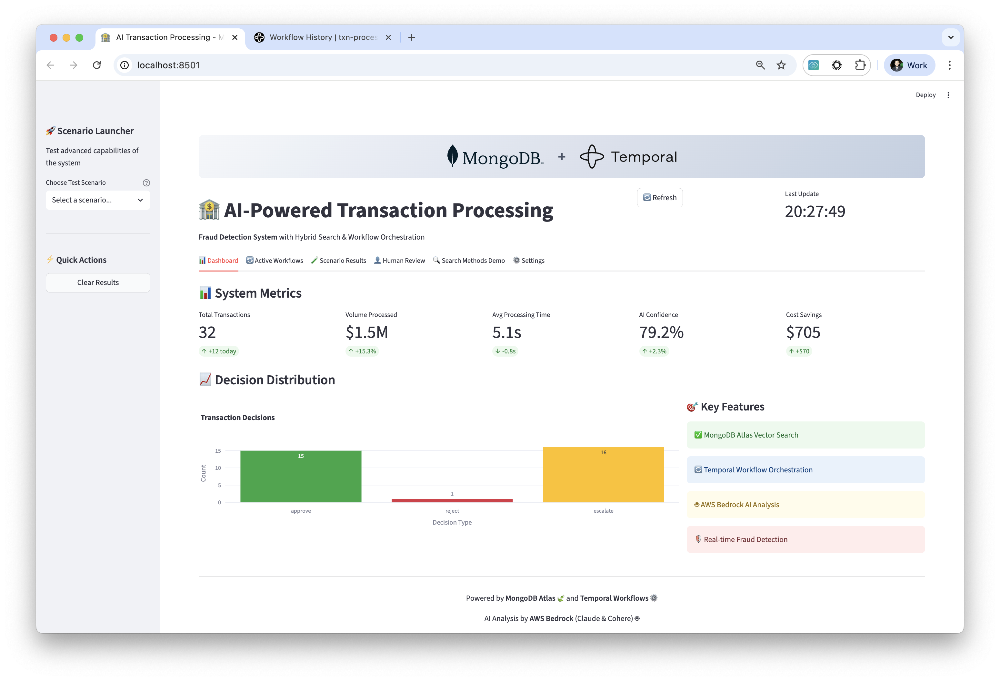
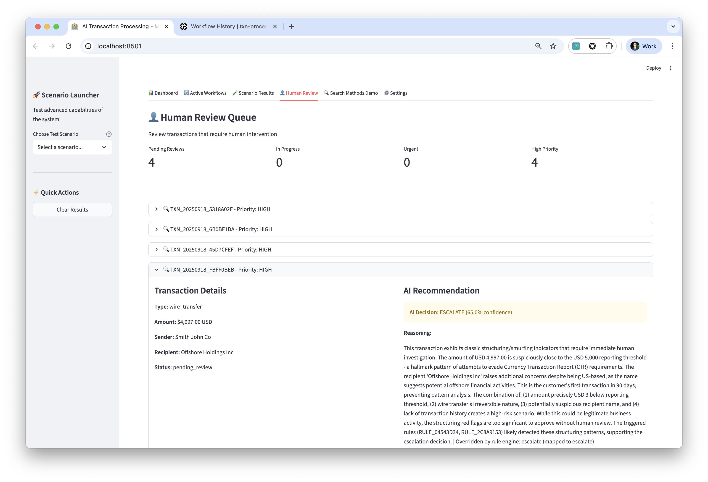
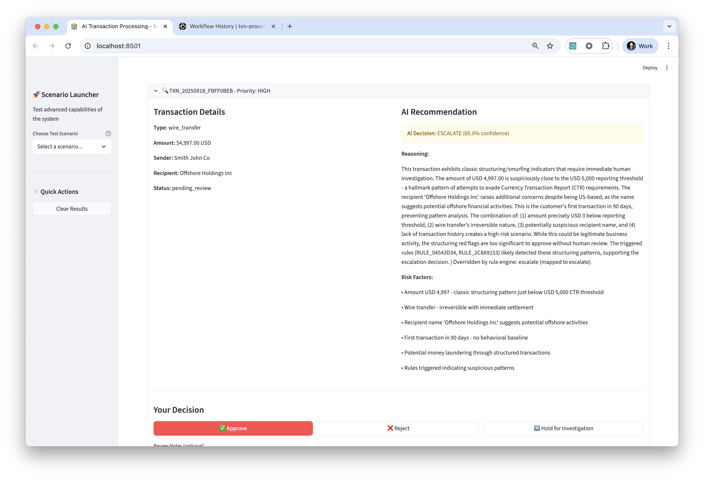
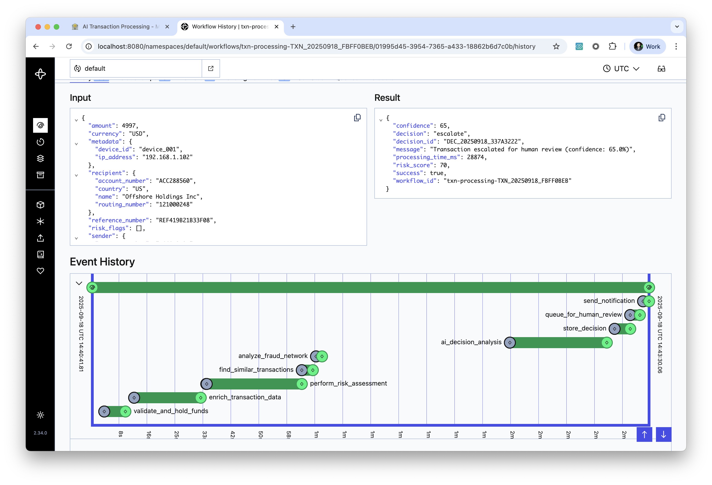

# UI Usage Guide

## Overview

The AI-Powered Transaction Processing System includes a comprehensive Streamlit dashboard for monitoring, testing, and managing transaction workflows. This guide walks you through using the UI for demonstration and evaluation purposes.

## Accessing the Dashboard

1. **Start the Dashboard**
   ```bash
   streamlit run app.py
   ```

2. **Open in Browser**
   - Navigate to: http://localhost:8501
   - The dashboard automatically refreshes every 30 seconds

## Dashboard Components

### 1. Main Dashboard View



The main dashboard provides:
- **MongoDB + Temporal Integration Banner** - Shows connected systems
- **System Status** - Real-time connection status and last update timestamp
- **Navigation Tabs** - Quick access to all system features
- **Scenario Launcher** - Left sidebar for running pre-configured test scenarios

### 2. Search Methods Demonstration


This tab showcases the hybrid search capabilities:

**Multi-Layer Search Strategy:**
- **Vector Similarity Search** - Semantic understanding using AI embeddings
- **Traditional Index Search** - Fast exact and range matching
- **Feature-Based Scoring** - Multi-dimensional similarity calculation
- **Graph Traversal** - Network analysis for fraud rings

**Method Effectiveness Table:**
- Shows detection rates and performance metrics
- Compares individual vs combined detection accuracy
- Demonstrates the power of hybrid approach

### 3. Scenario Launcher (Left Sidebar)

**Available Test Scenarios:**

1. **Fraud Ring Detection - Structuring Pattern**
   - Tests money structuring detection
   - Multiple wire transfers under $5000
   - Triggers compliance alerts for human review
   - Expected: ESCALATE decision

2. **Velocity Check - Rapid Fire Transactions**
   - Detects unusual transaction velocity
   - 10 transactions in 2 minutes
   - Tests rate limiting and pattern detection
   - Expected: ESCALATE after 3rd transaction

3. **High-Value Wire Transfer**
   - Tests manager approval workflow
   - Transaction over $50,000
   - Automatic escalation regardless of AI confidence
   - Expected: Pending manager approval

4. **Legitimate Business Transaction**
   - Normal business payment scenario
   - Tests auto-approval for low-risk transactions
   - Expected: APPROVE with high confidence

**How to Run Scenarios:**
1. Select a scenario from the dropdown
2. Review the description and expected outcome
3. Click "Run Scenario" button
4. Monitor results in real-time

### 4. Active Workflows Tab


**Features:**
- **Live Workflow Monitoring** - Shows currently processing transactions
- **Workflow Cards** - Display transaction ID, status, and processing time
- **Status Indicators:**
  - 🟢 Processing - Workflow is active
  - ✅ Completed - Successfully processed
  - ⚠️ Pending Review - Awaiting human decision
  - ❌ Failed - Processing error

**Workflow Details:**
- Click on any workflow card to view details in Temporal UI
- Shows all executed activities and their status
- Displays input/output data for debugging

### 5. Scenario Results Tab


**Displays:**
- **Scenario Description** - What the test is validating
- **Expected Outcome** - What should happen
- **Actual Results Table:**
  - Transaction ID
  - Decision (approve/escalate/reject)
  - Confidence Score
  - Risk Score
- **Success Indicators** - Green checkmarks for passed tests

### 6. Human Review Queue



**Queue Overview:**
- **Pending Reviews** - Number of transactions awaiting review
- **In Progress** - Currently being reviewed
- **Urgent** - High-priority transactions
- **High Priority** - Transactions requiring immediate attention

**Transaction List:**
- Shows all transactions requiring human review
- Sorted by priority (HIGH/MEDIUM/LOW)
- Click on any transaction to review details

### 7. Human Review Interface



**Review Components:**

**Transaction Details (Left Panel):**
- Transaction type and amount
- Sender and recipient information
- Current status
- Transaction metadata

**AI Recommendation (Right Panel):**
- AI decision and confidence level
- Detailed reasoning explanation
- Risk factors identified
- Suspicious patterns detected

**Your Decision (Bottom):**
- **Approve** - Override AI and approve transaction
- **Reject** - Confirm rejection
- **Hold for Investigation** - Escalate for further review
- **Review Notes** - Add comments for audit trail

**How to Review:**
1. Read transaction details carefully
2. Review AI analysis and risk factors
3. Make your decision based on combined information
4. Add notes explaining your decision
5. Click the appropriate action button

## Demo Walkthrough

### Step 1: Launch Test Scenario

1. In the left sidebar, select "Fraud Ring Detection" from dropdown
2. Click "Run Scenario" button
3. Watch as 3 transactions are submitted automatically

### Step 2: Monitor Processing

1. Click on "Active Workflows" tab
2. See the three workflows processing in real-time
3. Notice status changes as workflows progress

### Step 3: View Results

1. Navigate to "Scenario Results" tab
2. See all three transactions marked as "escalate"
3. Verify confidence scores are around 65%

### Step 4: Human Review

1. Go to "Human Review" tab
2. See 3 transactions in the queue
3. Click on the first transaction (TXN_20250918_45D7CFEF)
4. Review the AI analysis showing:
   - Structuring pattern detected
   - Amount just below $5000 threshold
   - Suspicious recipient name
5. Make a decision:
   - Click "Reject" to block the transaction
   - Or "Hold for Investigation" for further review

### Step 5: Check Temporal Workflow

1. Click on any workflow ID in Active Workflows
2. Opens Temporal UI showing:
   - Complete workflow execution history
   - All activities with timing
   - Input/output data for each step



## Key Features to Demonstrate

### 1. Real-time Processing
- Transactions process in under 3 seconds
- Live status updates without page refresh
- Immediate queue updates for human review

### 2. AI Integration
- Detailed reasoning for every decision
- Confidence scoring with thresholds
- Risk factor identification
- Pattern recognition across transactions

### 3. Hybrid Search Power
- Vector search finds semantically similar transactions
- Traditional indexes provide exact matches
- Graph traversal uncovers hidden networks
- Combined approach achieves superior accuracy

### 4. Human-in-the-Loop
- Seamless escalation for uncertain cases
- AI provides context for human decisions
- Full audit trail of all decisions
- Override capabilities with reason tracking

### 5. System Metrics
- Total transactions processed
- Volume in dollars
- Average processing time
- AI confidence trends
- Cost savings calculations

## Tips for Effective Demos

1. **Start with Dashboard Tab** - Show system overview and metrics
2. **Run Fraud Ring Scenario** - Demonstrates complex detection
3. **Show Human Review** - Highlights human-in-the-loop capability
4. **Open Temporal UI** - Shows reliability and debugging features
5. **Explain Search Methods** - Emphasizes technical sophistication

## Troubleshooting UI Issues

| Issue | Solution |
|-------|----------|
| Dashboard not loading | Check Streamlit is running on port 8501 |
| No workflows showing | Verify Temporal worker is running |
| Scenarios not working | Check API server is running on port 8000 |
| Data not refreshing | Click "Refresh" button or wait 30 seconds |
| Human review not updating | Ensure MongoDB connection is active |

## Advanced Features

### Custom Transaction Submission

While not shown in UI, you can submit custom transactions via API:

```bash
curl -X POST http://localhost:8000/api/transactions \
  -H "Content-Type: application/json" \
  -d '{
    "transaction_id": "CUSTOM-001",
    "amount": 10000,
    "currency": "USD",
    "type": "wire_transfer",
    "source_account": "ACC-001",
    "destination_account": "ACC-002",
    "description": "Custom test transaction"
  }'
```

Then monitor it through the dashboard.

### Viewing Historical Data

- Use MongoDB Compass to connect to your Atlas cluster
- Query collections directly for historical analysis
- Export data for reporting and analytics

## Next Steps

- Review the [Evaluation Guide](EVALUATION_GUIDE.md) for testing procedures
- Check [Architecture Documentation](ARCHITECTURE.md) for technical details
- See [Troubleshooting Guide](TROUBLESHOOTING.md) for common issues